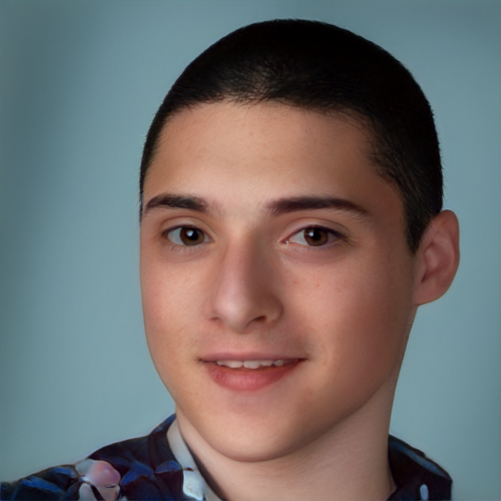

<section>

## About Me

<figure class="floater">
    
    <figcaption style="max-width: 256px;">If you see this picture, it is almost certainly me—even if the picture strictly is not (courtesy of StyleGAN2 FFHQ Config F).</figcaption>
</figure>

<section>

### Academics

I attended [Downingtown High School West Campus](https://en.wikipedia.org/wiki/Downingtown_High_School) from <time datetime="2015-09">September 2015</time> through <time datetime="2019-06">June 2019</time>, at which time I graduated sixth in my class (of 384) with a weighted <abbr title="Grade Point Average">GPA</abbr> of 4.4. During that time, I received a [Bausch + Lomb Honorary Science Award](https://admissions.rochester.edu/high-school-awards/) for scientific achievement as a junior and was listed on the distinguished honor roll for all four years I attended.

After high school, I selected to enter undergraduate study at the Pennsylvania State University in pursuit of a [Bachelor of Science in (General) Engineering](https://bulletins.psu.edu/undergraduate/colleges/engineering/engineering-bs/) as part of their (very small) [Multidisciplinary Engineering Design](https://www.brandywine.psu.edu/academics/bachelors-degrees/engineering) program, which is offered through [Brandywine](https://www.brandywine.psu.edu/) with additional support from [Great Valley](https://greatvalley.psu.edu/). I was a student of the program until voluntarily leaving the university due to various personal circumstances in <time datetime="2023-04-06">April 2023</time>. After a two-semester gap, I returned in <time datetime="2024-01-08">January 2024</time> to complete my degree, and after a year-long Capstone, graduated on <time datetime="2025-05-10">May 10, 2025</time>.

</section>
<section>

### Experience

<section>

#### Competition Robotics

I participated in the VEX Robotics Competition (now branded as the [VEX V5 Robotics Competition](https://en.wikipedia.org/wiki/VEX_Robotics#VEX_V5_Robotics_Competition)) as a member of the world-renowned [VEXMEN](https://www.vexmen.com/) of [Brandywine Robotics](https://brandywinerobotics.org/) throughout my secondary schooling, first as a part of Team <samp>80P</samp> <i>VEXMEN: Pyro</i> for the 2012–2013 season ([Sack Attack](https://vrc-kb.recf.org/hc/en-us/articles/9661809013015-VRC-History-2012-2013-Sack-Attack)), and after the team was split in two, as a part of Team <samp>80Y</samp> <i>VEXMEN: Cypher</i> for the 2013–2014 ([Toss Up](https://vrc-kb.recf.org/hc/en-us/articles/9661569769111-VRC-History-2013-2014-Toss-Up)) and 2014–2015 ([Skyrise](https://vrc-kb.recf.org/hc/en-us/articles/9661504917911-VRC-History-2014-2015-Skyrise)) seasons. <i>VEXMEN: Cypher</i> transitioned into high school with a number change to <samp>81Y</samp> for the 2015–2016 season ([Nothing But Net](https://vrc-kb.recf.org/hc/en-us/articles/9661371440151-VRC-History-2015-2016-Nothing-But-Net)), and would continue participating that way for the 2016-2017 ([Starstruck](https://vrc-kb.recf.org/hc/en-us/articles/9661321161879-VRC-History-2016-2017-Starstruck)), 2017–2018 ([In The Zone](https://vrc-kb.recf.org/hc/en-us/articles/9661170051351-VRC-History-2017-2018-In-the-Zone)), and 2018–2019 ([Turning Point](https://vrc-kb.recf.org/hc/en-us/articles/9661009797527-VRC-History-2018-2019-Turning-Point)) seasons, after which the team aged-out of competition.

Teams <samp>80Y</samp> and <samp>81Y</samp> <i>VEXMEN: Cypher</i> were highly successful. <samp>80Y</samp> attended the 2015 VEX Robotics World Championship, and through a combination of luck, skill, and smooth-talking, managed to find itself a Middle School Tournament Finalist (and nearly winning the prestigious Excellence Award). After a gap of a year, <samp>81Y</samp> qualified and returned to the VEX Robotics World Championship in 2017 by winning the High School Excellence Award at the Pennsylvania State Championship, of which it would return with an Engineering Award. <samp>81Y</samp> attended the VEX Robotics World Championship for the last time in 2018 by qualifying as a Tournament Finalist of the Pennsylvania State Championship, and represented the team's most successful run: As the only team in the tournament to win every autonomous period it participated in, through sheer consistency it defeated the top-ranked seed in Research division to become a Division Champion and High School Tournament Finalist.

My primary role with <i>VEXMEN: Cypher</i> throughout its lifetime was, [perhaps fittingly](https://en.wikipedia.org/wiki/Cypher_(Marvel_Comics)), being the team's dedicated programmer. The experience accumulated established a strong background in embedded programming, system design & integration, and controls. 

</section>
<section>

#### Lockheed Martin Learning for Life Aviation

Hosted by volunteers of both former and then-current employees of the Sikorsky Coatesville plant, this program involved a variety of educational activities related to the field of aviation. The program's primary focus, however, was restoring a RotorWay Scorpion Too acquired by the American Helicopter Museum of West Chester, Pennsylvania, to displayable condition. After (many, many) hours of labor, the (now blue) Scorpion Too restored by the program is now [on display, paired alongside a Model 133](https://americanhelicopter.museum/aircraft/rotorway-scorpions/).

</section>
<section>

#### EleutherAI

I stumbled into joining EleutherAI as a contributor in <time datetime="2021-02">February 2021</time>, and would later become a core member by <time datetime="2021-03">late March 2021</time>. During my time volunteering, I would become maintainer and webmaster of the EleutherAI website and blog, redevelop its logo, and (most significantly) assist in the creation of [GPT-NeoX-20B](https://arxiv.org/abs/2204.06745). After two years of dedicated contributorship and direct involvement in three published papers, various personal and interpersonal circumstances made my volunteering unsustainable and forced me to depart against my desire in <time datetime="2023-03-15">March 2023</time>.

</section>
<section>

#### Intel Innovators Program

As a long-time Intel graphics user perpetually jaded by NVIDIA's antics and intrigued by the emergence of a new competitor in the discrete graphics and accelerator market, I applied for and was [granted access to the Intel Innovators program](https://twitter.com/EricHallahan/status/1666283979203305472) for my work on GPT-NeoX-20B in <time datetime="2023-06-06">June 2023</time>. This has led to my ongoing amateur involvement in Intel developer relations (notably as a moderator of the Intel DevHub Discord server), for which in return I've received hardware (such as an Arc A770 Limited Edition and a Lunar Lake Development Kit) to experiment with. I currently intend to continue in this role in some capacity until it becomes unsustainable or I am contractually obligated to cease.

</section>
<section>

#### Panverse Robotics

What came to be known as Panverse Robotics was a venture formed by me and a few other EleutherAI regulars in <time datetime="2023-08">late-mid 2023</time> as an attempt to secure a [Batch 2 Commercial AI Grant](https://aigrant.com/) seed investment through a plan for advanced usage of neural fields for robotics. Despite making it far with our initial pitch, we were ultimately not selected and pivoted to a bootstrapping business plan built around the then-emerging 3D Gaussian Splatting (<abbr title="3D Gaussian Splatting">3DGS</abbr>) concept, an initial phase of which was a consumer-focused <abbr title="3D Gaussian Splatting">3DGS</abbr> service marketed as <i>Portality</i>. Ultimately, the small team was unable to reach market fast enough before larger players with more resources entered, and with Portality still not fully launched before <time datetime="2024-04">Q2 2024</time>, the company reached the end of its run and was dissolved by the end of that calendar year.

</section>
</section>
</section>

<section>

## About this site

This site is one I have constructed myself to be my personal public portfolio and blog. There is no particular focus, other than it is all content I would like to make accessible beyond myself and share with others—expect articles of varying types covering a range of topics and experiences, most often of primarily technical or academic nature written to an audience I feel will best benefit from the communication of the content.

This site is statically generated with [Hugo](https://gohugo.io/) and strives to be as accessible to navigate and consume as possible across screen sizes and device types. It is perpetually in development, and site organization is not yet concrete; at this point in time, articles are living documents and I may change site content as I see fit. Suggestions for improvement are welcome—readership should feel free to drop me a line if there is a change they believe can improve the user experience.

</section>

<section>

## Contacting and Inquiries

Those looking to contact me, the author, maintainer, and webmaster of this site, can do so through a multitude of platforms:

<dl>
    <dt>Twitter</dt>
    <dd><a href="https://twitter.com/EricHallahan"><samp>@EricHallahan</samp></a>: Direct message requests open</dd>
    <dt>Discord</dt>
    <dd><samp>erichallahan#0</samp>/<samp>EricHallahan#1051</samp>: Available via my <a href="https://discord.gg/MAkqqfMPgF">personal server</a>, direct message requests open</dd>
    <dt>LinkedIn</dt>
    <dd><a href="https://www.linkedin.com/in/eric-hallahan-a0aa34188/">Eric Hallahan</a>: Messaging available (though not preferred)</dd>
    <dt>Email &amp; Telephone, Signal</dt>
    <dd>Personal email, telephone, and Signal available upon request</dd>
</dl>

Respectful inquiries of all kinds are welcome.

</section>
